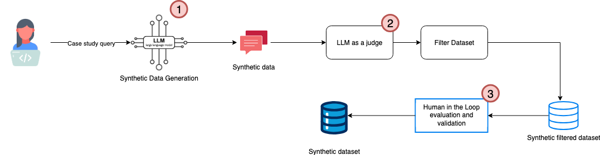

# PhysiCase: A Synthetic Dataset for case studies education in Physiotherapy 
--------------------------------------------------------------------------
High-quality, domain-specific datasets are foundational to advancing educational tools and AI systems in healthcare, yet assembling case repositories from real-world clinical records faces substantial privacy, ethical, and licensing barriers. Synthetic data generation offers a compelling pathway forward, but educational cases require rigorous validation to ensure clinical plausibility and pedagogical utility.

  
We generated 128 synthetic MSK cases using four frontier large language models (GPT-4.1, GPT-4o, Google Gemini 2.5 Pro, and Llama 4 Scout) across 28 clinical conditions. Cases underwent automated quality screening using an "LLM-as-judge" framework (DeepEval) assessing prompt alignment, JSON correctness, answer relevance, bias, toxicity, and completeness. Ninety cases (70.31\%) passed automated filtering and proceeded to expert evaluation by four MSK physiotherapy educators, who rated medical accuracy, realism, fidelity, relevance, and usability on 5-point Likert scales.

------------------
PhysiCase Pipeline
------------------

---------
Acknowledgement
---------
The annotation was made possible Label Studio (“Label Studio”. Available at https://labelstud.io)

---------
Reference
---------
